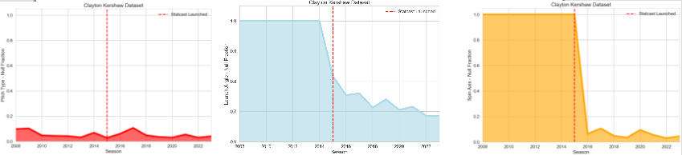
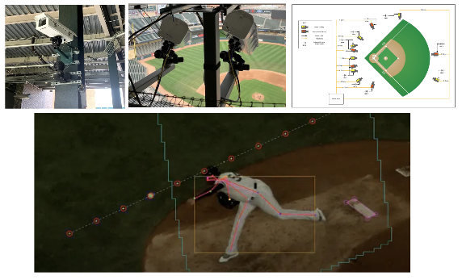
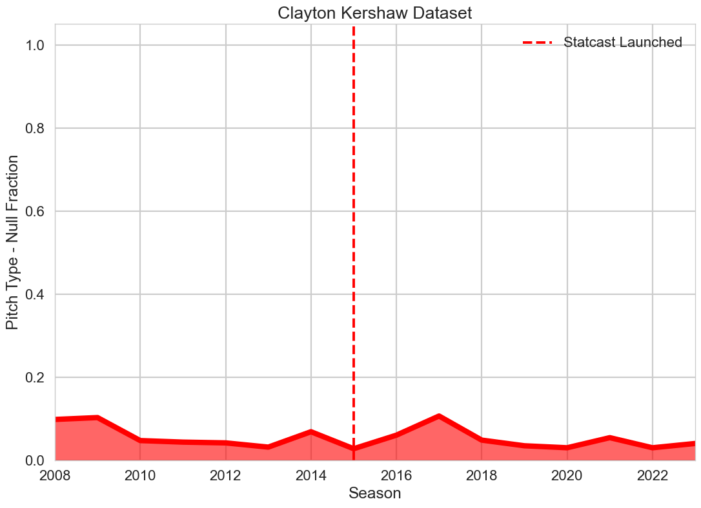
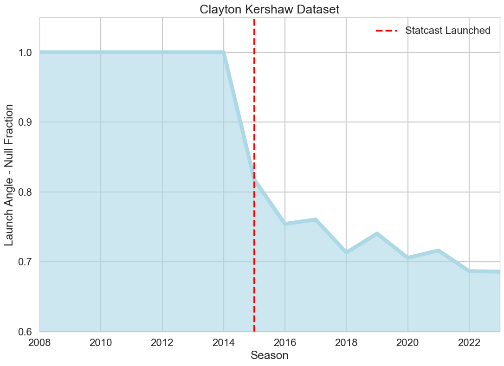
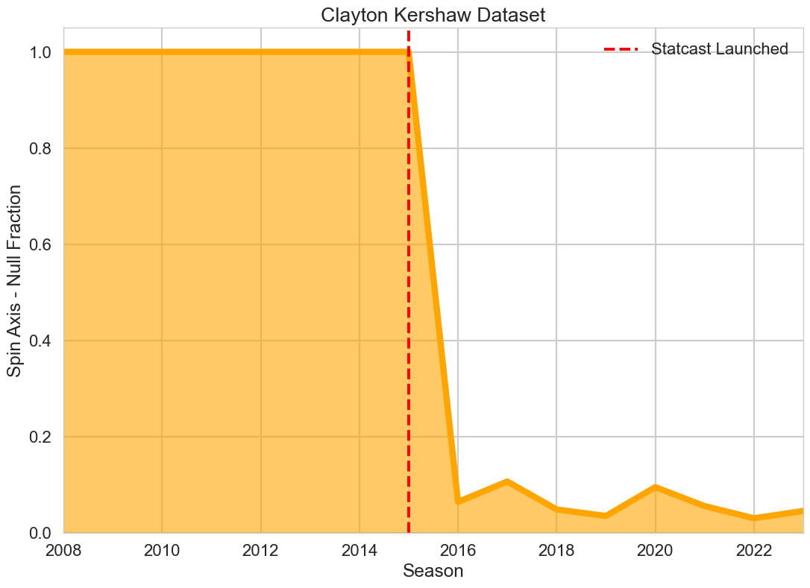

# Data-Eras-of-MLB
An examination of the impact of the history of automated data collection platforms on 
MLB in-game data collection. 

In the analysis that follows the aim is to observe first hand, in the best pitching datasets publicly
available today, the impact the history and evolution of MLB's in-game sensing platforms have 
had on the growth of MLB data categories available for open-source analysis projects. 

### Automated Data Collection Systems in Major League Baseball (MLB)

The history of data collection technologies in Major League Baseball (MLB) has evolved significantly, moving from PITCHf/x to Statcast, and most recently to the Hawk-Eye system. Here's a brief overview:

#### PITCHf/x
PITCHf/x was introduced in MLB in 2006. It used three cameras installed in each MLB stadium to 
track the velocity, movement, release point, and location of pitches. PITCHf/x marked a revolution in baseball analytics, allowing teams, analysts, and fans to study the game in unprecedented detail, particularly pitching.

#### Statcast
MLB introduced Statcast in all 30 parks in 2015. Statcast was a significant step up from PITCHf/x. 
It used radar and optical tracking (initially a combination of radar technology from TrackMan and 
optical technology from ChyronHego) to measure not just pitches but also player movements, 
batted ball statistics, and more. This system collected data on an enhnaced feature set 
from in-game play, including exit velocity, launch angle, and sprint speed, offering a 
comprehensive picture of both pitching and hitting, as well as fielding.

The Hawk-Eye platform, as depicted in [4]. 

#### Hawk-Eye
Hawk-Eye was adopted by MLB starting in the 2020 season, representing a new technological leap in MLB sensing platforms.
Replacing Statcast's radar system, Hawk-Eye uses a series of high-resolution optical cameras 
around the stadium. It's more accurate in tracking the baseball and player movements.
Hawk-Eye provides improved accuracy and a wider array of data points. It can capture the spin 
rate of pitches, the stance and movements of players, and more intricate details of every play.
Evolutionary Significance

 
#### MLB Sensor Platform Evolution

With each technological iteration, the accuracy and detail of data collection in MLB have 
improved significantly. This data has transformed and continues to transform how players are 
evaluated and trained, how games are analyzed, and how fans understand the sport. Each system's 
introduction marked a pivotal moment in the evolution of baseball analytics, 
enabling and accelerting the sport's growing emphasis on data-driven decision-making and analytics.

#### Discussion

With the launch of the Statcast system in 2015, precision data on batted balls became 
available. This is reflected in the Kershaw pitched-ball dataset studied in this notebook. 
The percentage of recorded pitch_type data records remains roughly constant from 2008 through 
2023 (the current span of Clayton Kershaw's career), while the launch_angle data only starts 
being recorded in the 2015 season, after Statcast's introudciton in MLB stadiums. 
spin_axis data takes an additional year, to 2016, to begin being aggregated in MLB's data archive.
This preliminary investigation was undertaken to better understand the aggregated Kershaw pitch
dataset in greater detail in preparation for analysis projects to follow, and also to see how the 
history of MLB in-game sensing platforms is relfected in today's MLB datasets. 

### References

[1] https://baseballsavant.mlb.com/csv-docs

[2] https://baseballsavant.mlb.com/leaderboard/spin-direction-pitches

[3] McElroy, Luke. "Computer Vision in Baseball: The Evolution of Statcast." (2022)

[4] https://technology.mlblogs.com/introducing-statcast-2020-hawk-eye-and-google-cloud-a5f5c20321b8 (2020)

